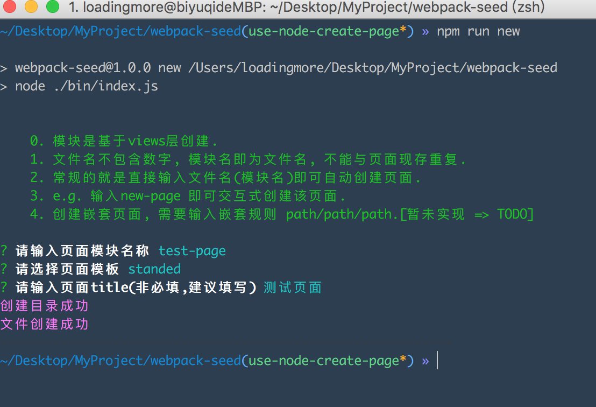
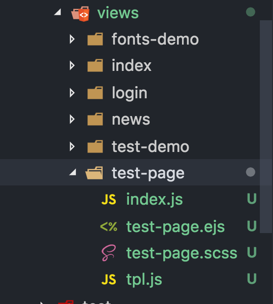

## 运行

创建新页面, 暂时支持两种模板
```js
npm run new
```
## screenShots



## 模板
页面种类config配置即可

```js
目前：standed & notStanded
standed: 含有header footer
notStanded: 不含有header footer
```

## TODO

- [ ] 支持多目录嵌套生成
- [ ] 重构代码